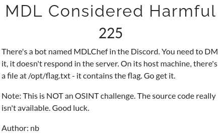
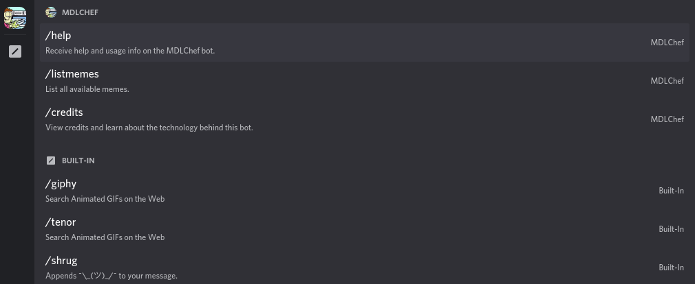
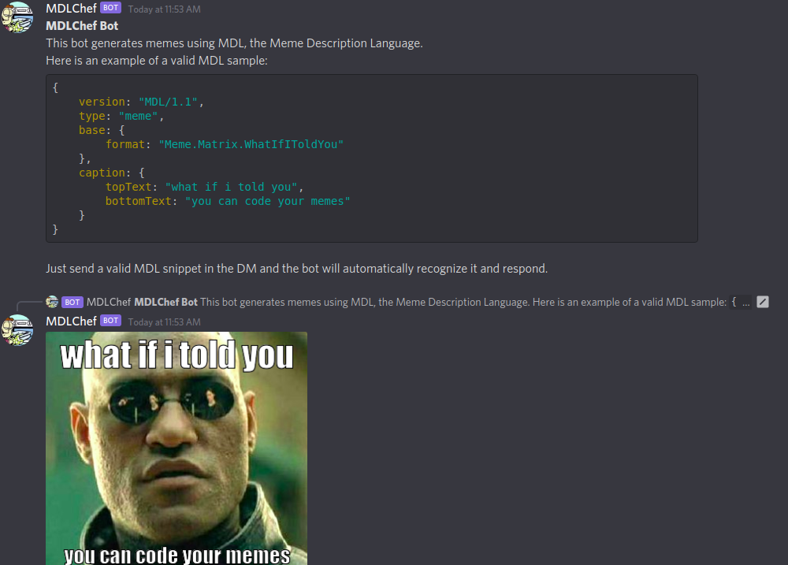
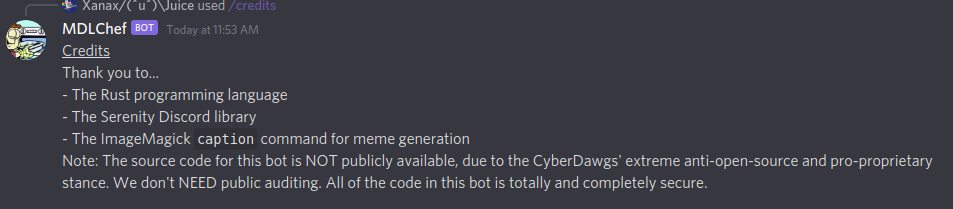
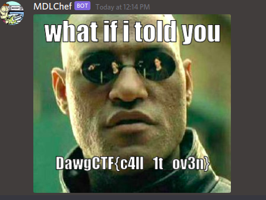

# MDL Considered Harmful

**Category: Pwn**



# MDL Bot commands



So we have three commands that we can use `/credits`, `/help` and `/listmemes`. 
Let's try them.

# MDL help command /help



Okay it seems that there is a meme language for this one. A JSON variation some kind. 

# MDL list memes command /listmemes


More memes that we can choose in the `format` field in the prievious JSON syntax.

# MDL credits command /credits



It's written in rust so hopes for buffer overflows or nasty exploitation are nearly zero.
But we see that it uses imagemagick's `caption` command and it is highlighted so i thought the bot is running in the background imagemagick's `caption` command in a shell.

So let's dig the documentation about imagemagick's command line options.

https://imagemagick.org/script/command-line-options.php

Searching for `caption` option we get:
```
-caption string

Assign a caption to an image.

This option sets the caption meta-data of an image read in after this option has been given. To modify a caption of images already in memory use "-set caption".

The caption can contain special format characters listed in the Format and Print Image Properties. These attributes are expanded when the caption is finally assigned to the individual images.

If the first character of string is @, the image caption is read from a file titled by the remaining characters in the string. Comments read in from a file are literal; no embedded formatting characters are recognized.

Caption meta-data is not visible on the image itself. To do that use the -annotate or -draw options instead.

For example,

    -caption "%m:%f %wx%h"  bird.miff

produces an image caption of MIFF:bird.miff 512x480 (assuming that the image bird.miff has a width of 512 and a height of 480.
```

The important line is:
```
If the first character of string is @, the image caption is read from a file titled by the remaining characters in the string. Comments read in from a file are literal; no embedded formatting characters are recognized.
```

Maybe if we try...

```
{
    version: "MDL/1.1",
    type: "meme",
    base: {
        format: "Meme.Matrix.WhatIfIToldYou"
    },
    caption: {
        topText: "what if i told you",
        bottomText: "@/opt/flag.txt"
    }
}
```


